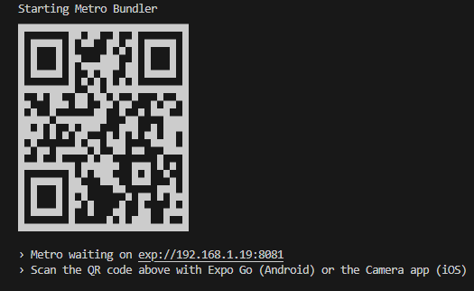

# Interrapidismo React Native test

React Native aplication

# Requeriments

- NodeJs
- npm

## Available Scripts
### `1. npm install`

Run to install all the project dependencies

Ejecuta para instalar las dependencias del proyecto

### `2. npm run start`

Runs the app in the development mode

Ejecuta la aplicación en modo desarrollo

You can install an android emulator with android studio or you can download the expo go app to your phone. Once installed, by scanning the QR code that appears on the terminal you will be able to see the application

Puedes instalar un emulador de android con android studio o puedes descargar en tu telefono la app expo go, una vez instalada al escanear el codigo QR que aparece en la terminal podras ver la aplicación

